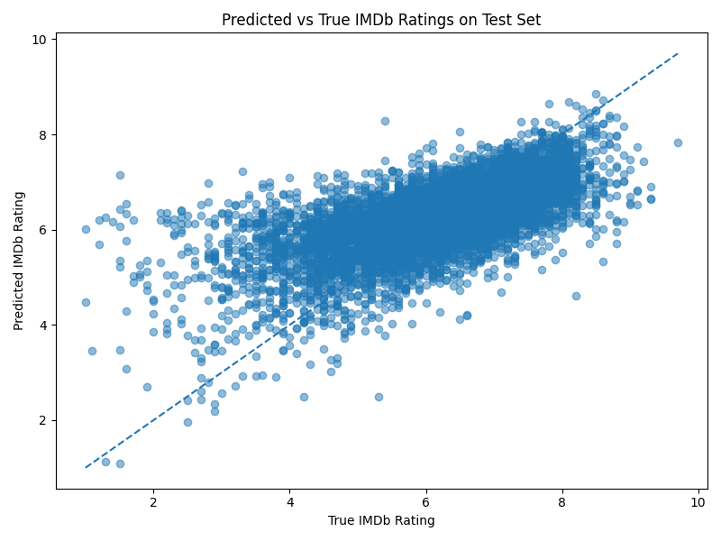
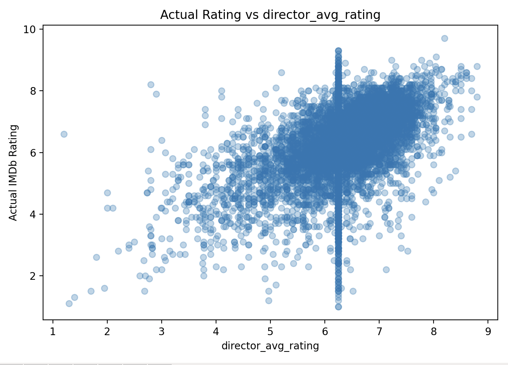
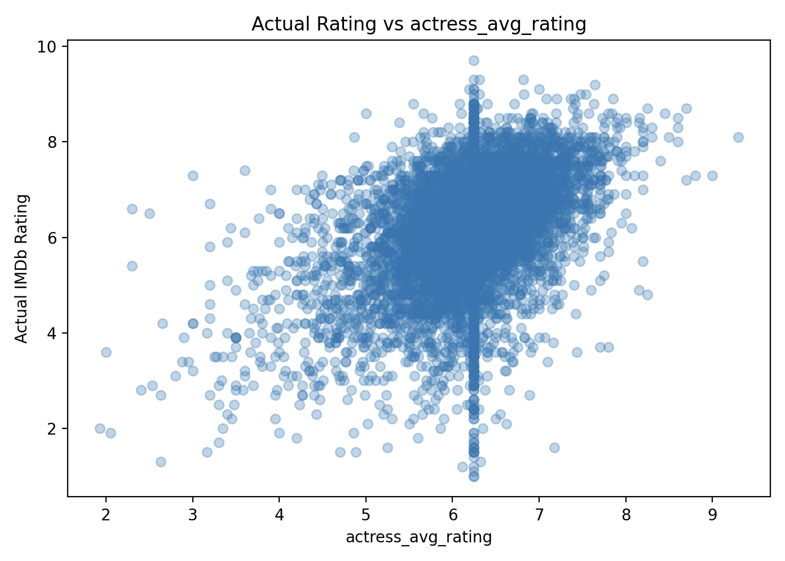
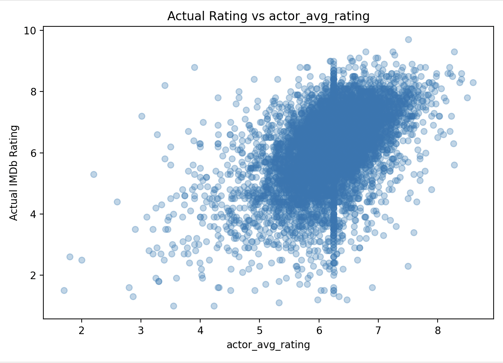
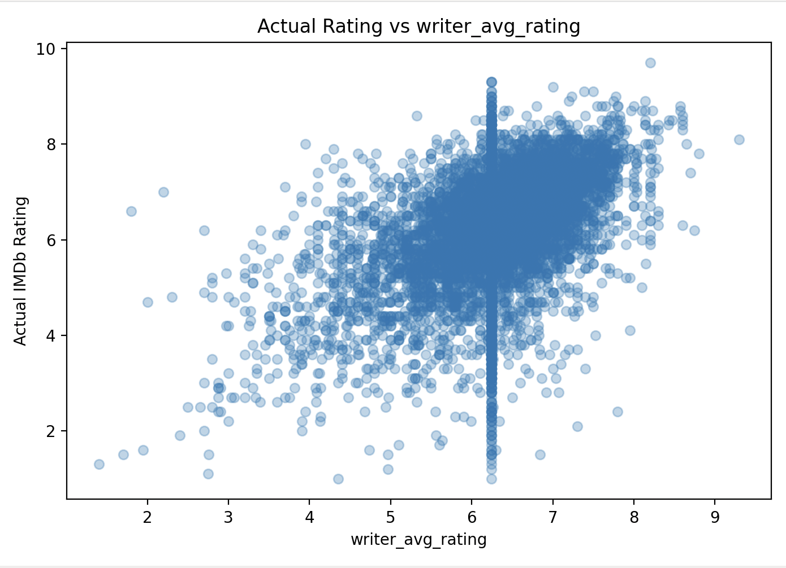

## **CS506Project**

## Project Topic Description

We aim to predict what makes a movie successful by analyzing previous movie data including ratings, genre, runtime, and release year. By analyzing these factors, we will build a predictive model to forecast a movie's IMDb rating based on its characteristics. Data will be collected from IMDb's official free dataset downloads.

## Project Timeline

Week 1: Data collection from IMDb website and load datasets into Python using pandas

Week 2: Data cleaning and processing (Merge files into one, remove duplicate movies, and handle missing column values)

Week 3-4: Feature extraction (Select relevant features like genre, runtime, year)

Week 5-6: Data visualization (Plot relevant features that could help with predicitoins and look for patterns)

Week 7-8: Model training and evaluation (Using decision tree or linear regression for predicting the IMDb rating)

Week 9: Writing Final Report

## Project Goals

Successfully predict a movie's IMDb rating based on features such as genre,
release year, runtime, and director. A clear goal is to identify which features
most strongly predict a movie's rating and popularity.

## Potential Data Sources

IMDb Official Datasets :
https://datasets.imdbws.com
- title.basics.tsv.gz genre, runtime, release year
- title.ratings.tsv.gz IMDb rating and number of votes
- title.crew.tsv.gz directors and writers

## Data Collection Method

Direct free download from datasets.imdbws.com.

## How to Build and Run the Code
The project is organized into three main python files:

- `dataset.py`: This file loads and cleans the IMDb datasets, creates genre dummy variables and principal count features, and then saves `movies_cleaned.csv`.
- `training.py`: This file loads the cleaned dataset, creates average rating features for actors, actresses, directors, and writers, trains a Linear Regression model, evaluates performance by RMSE, MAE, R2, and saves `plotting_data.csv`.
- `plottings.py`: This file loads `plotting_data.csv` and creates visualizations showing relationships between the selected features and actual IMDb ratings.

## Required IMDb Data Files

The original IMDb dataset files are not included in this github repository because they are too large. To run the code, you can download the required files (listed below) from the IMDb datasets page:

https://datasets.imdbws.com

Required files:

- `title.basics.tsv.gz`
- `title.ratings.tsv.gz`
- `title.principals.tsv.gz`

## Installing dependencies

To install all required packages, run `make install`. 

## Running the project

To run the full project, run `make run

## Data Processing

The data processing that happens in dataset.py:

1. Loading the IMDb datasets.
2. Merging title.basics.tsv.gz and title.ratings.tsv.gz using the movie ID column, tconst.
3. Using title.principals.tsv.gz to create count features for each movie.
4. Filtering the dataset to include only movies and replacing missing values with NaN.
5. Converting columns types to numeric (startYear, runtimeMinutes, averageRating, and numVotes).
6. Removing movies with less than 1000 votes so that the ratings are more reliable.
7. Removing duplicate movie titles and keeping only the version with the highest number of votes.
8. Converting the genres column into dummy variables (Action, Comedy, Drama, and Horror, etc)

## Features Used in the Model

The target variable is averageRating.

The original IMDb features used are:

- **startYear**
- **runtimeMinutes**
- **numVotes**

The principal count features created from title.principals.tsv.gz are:

num_principals (Count total number of main credited people per movie)
actor (Count number of actors per movie)
actress (Count number of actresses per movie)
director (Count number of directors per movie)
writer (Count number of writers per movie)
 ... and so on

The genre dummy features created from the genres column include:

- **Action**
- **Adventure**
- **Animation**
- **Biography**
- **Comedy**
- **Crime**
- **Documentary**
- **Drama**
- **Family**
... and so on

Each genre column is coded as 1 if the movie belongs to that genre and 0 otherwise.

The improved model (in the training.py file) also creates person-rating features across all rated movies:

- **actor_avg_rating**
- **actress_avg_rating**
- **director_avg_rating**
- **writer_avg_rating**

For each movie, the code looks at the actors, actresses, directors, and writers listed for that movie, it then calculates the average historical IMDb rating of those people based only on the training set.

The person rating features were added because they provide more meaningful information than simple counts. Instead of only knowing how many actors or directors are associated with a movie, the model also gets information about the past rating performance of the people involved.

## Modeling

As discussed in our final check-in with Eric, we eliminated using logistic regression and decesion tree classifiers, because IMDb ratings are numeric values, so this is a regression problem rather than a classification problem. The goal is not to categorize movies. We want to predict a rating score as close as possible to the actual rating.

The project uses **Linear Regression** because the target variable, `averageRating`, is continuous. In addition, we chose linear regression because our features are numeric variables, such as, principal count features, and historical average rating features.

We also considered more complex models, but decided not to use them as the main approach. In the previous midterm, TF-IDF was useful because the dataset included review text, meaning the model could learn directly from words that expressed positive or negative sentiment. In this project, the main dataset is not text based and it mostly contains movie metadata, so TF-IDF is not useful.

The model is trained using an 80/20 train test split. The training set is used to fit the model, and the test set is used to evaluate how well the model predicts ratings for movies it has not seen before. We also created person rating features using only the training set.

The evaluation metrics are:

- **RMSE**: Root Mean Squared Error
- **MAE**: Mean Absolute Error
- **R2**: Proportion of rating variation explained by the model

## Results

We compared a baseline linear regression model and a linear regression model using principal features. The baseline model used basic movie metadata, genre dummy variables, and principal count features. The improved version added historical person rating features.

Baseline model results:

Model | RMSE | MAE | R2 |
|---|---:|---:|---:|
| Baseline | 0.9585 | 0.7138 | 0.3393 |
| With Principals | 0.8802 | 0.6419 | 0.4427 |

Adding principal count features improved our model's performance.

These are the predicted values plotted against the true values for the IMDb rating from the test set of the data:

## Visualizations

The visualizations are created in `plottings.py`.

The main visualizations focus on the relationship between person rating features and actual IMDb ratings:

| Feature Relationship | Plot |
|---|---|
| Actual rating vs `actor_avg_rating` |  |
| Actual rating vs `actress_avg_rating` |  |
| Actual rating vs `director_avg_rating` |  |
| Actual rating vs `writer_avg_rating` |  |

Note that each point in these scatter plots represents one movie.

Across the plots, there is a slight upward trend. This means that movies with actors, actresses, directors, or writers who have stronger average ratings for their previous work also tend to have higher actual IMDb ratings. 

Some plots also show a vertical concentration around the global training average rating. This happens when a movie has people with no previous rating history in the training set. The missing value is filled with the average rating of all movies in the training set. 

## Testing

The project includes a small test suite in the tests/ folder. The tests check that the required project files exist, python packages can be imported, the README exists and that the project structure is valid.

To run tests, run `make test`

# GitHub Workflow
The repository includes a GitHub Actions workflow in:

.github/workflows/tests.yml